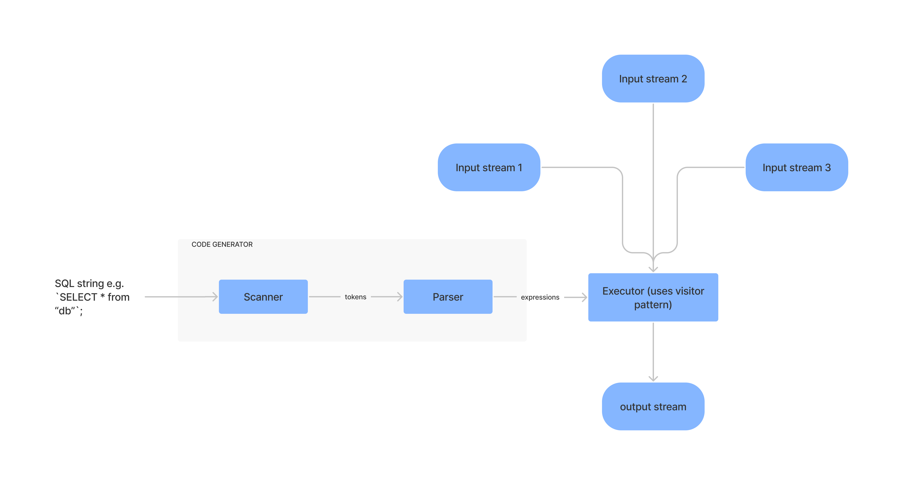

# Design of EliQL

This document contains the design decisions made in regard to making EliQL work.

## Data Flow

Here is how data flows through the system.

- We have pre-existing streams of data that can be subscribed to
- We have an EliQL string passed into the code generator
- The code generator's scanner transforms the EliQL string into an array of tokens
- The code generator's parser transforms the array of tokens into a single expression
- The expression is then executed by the Executor which must fully implement the [visitor-pattern](https://en.wikipedia.org/wiki/Visitor_pattern#:~:text=In%20object%2Doriented%20programming%20and,structures%20without%20modifying%20the%20structures.) of the `Visitor` interface.

## Acknowledgment

A lot of the ideas used in this project are shamelessly borrowed from the [Crafting Interpreters](https://craftinginterpreters.com/) book written by [Robert Nystrom](http://journal.stuffwithstuff.com/)